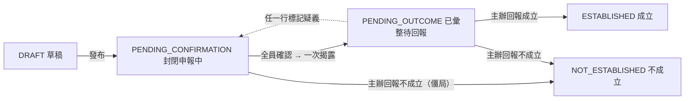
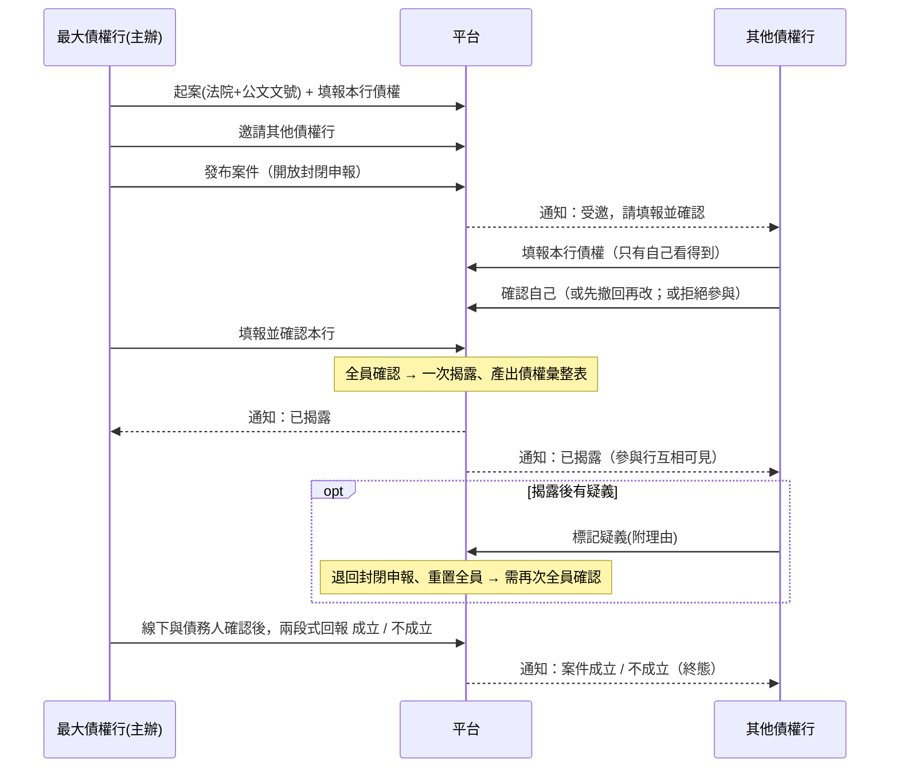

# 操作與測試手冊（MANUAL）

> 適用版本：**v0.4e**（v0.3 債權申報與彙整流程；**無還款管理**；含債權彙整表／6 類債權／對內債權，並新增**填報防呆、一類一筆、參與行治理防護、案件列表篩選／排序／分頁、草稿異動刪除與調解庭期**）。本手冊說明**各角色如何操作**與**如何測試**，並附流程圖。
> 平台網址：staging 為 `https://debit-ex-platform-staging.baasinnovation.com`；本機 demo 為 `http://localhost:5173`；純 IP 部署為 `http://<公網IP>`。
> 流程設計見 [`docs/案件流程設計_債權申報與彙整.md`](docs/案件流程設計_債權申報與彙整.md)；部署與環境見 [`docs/系統現況與執行說明.md`](docs/系統現況與執行說明.md)。

---

## 一、系統簡介與角色

跨銀行「前置調解**債權申報與彙整**」平台。一件案件＝一位債務人的一次調解，以 **法院＋公文文號** 辨識（不儲存債務人個資）。系統只做「債權資訊傳遞與彙整」：各行**封閉申報**自己的債權 → 全員確認後**一次揭露、產出債權彙整表** → 主辦線下與債務人確認後**回報成立／不成立**。**無還款計劃、無時限控管；債務人與法院全程線下。**

| 角色 | 說明 | 主要能做的事 |
|---|---|---|
| **平台管理員（ADMIN）** | 平台管理單位（開發商） | 建立帳號並核發啟用碼、機構（銀行/法院）啟用管理、核發密碼重置碼、檢視稽核。**只見案件狀態與進度，不見任何金額** |
| **最大債權行（主辦）** | 建立案件的銀行（BANK_STAFF） | 起案、填報**本行**債權、邀請/移出參與行、發布、回報成立／不成立 |
| **其他債權行** | 受邀的銀行（BANK_STAFF） | 填報**本行**債權、確認／撤回確認、拒絕參與、揭露後標記疑義、檢視債權彙整表 |
| **平台稽核（PLATFORM_AUDITOR）** | 平台管理單位 | 全案唯讀、**可見全部**（含各行明細）、檢視稽核 |

> 「最大債權行／其他債權行」是**因案動態認定**：同一個銀行帳號，在自己建立的案件是主辦，在別人邀請的案件就是其他債權行。
> **封閉期可視性**：申報期間各行**只見自己的數字**；全員確認**揭露後**參與行才互相可見。平台管理員**全程不見金額**，稽核**全程可見**。

---

## 二、流程總覽圖

### 2-1 案件生命週期

### 2-2 角色互動（時序）

### 2-3 正式區帳號啟用

---

## 三、共通操作

### 3-1 登入
1. 開啟平台網址 → 登入頁。
2. **銀行／機構下拉**選擇你所屬的機構（務必選對，選錯會顯示通用錯誤）。
3. 輸入 **Email** 與 **密碼** → 按「登入」。

### 3-2 帳號啟用（正式區新帳號首次登入）
1. 向管理員取得**啟用碼**（經你們內部管道交付）。
2. 登入頁：選銀行、輸入 Email、**把啟用碼填在「密碼／啟用碼」欄** → 按登入。
3. 系統跳出「啟用帳號」畫面：輸入**新密碼**（至少 8 碼）、再次確認、**勾選個資蒐集/利用同意**（必勾）→ 按「完成啟用並登入」。
4. 之後改用你設定的新密碼登入。
> demo 區的示範帳號已預先啟用，可直接用密碼 `Demo@1234` 登入，無需啟用。

### 3-3 忘記密碼
1. 登入頁 →「忘記密碼」。
2. 分頁「**申請重置**」：選銀行＋Email → 送出（管理員會收到申請）。
3. 向管理員取得**重置碼**後，回本頁分頁「**我已有重置碼**」：填銀行＋Email＋重置碼＋新密碼 → 送出。

---

### 3-4 案件列表：篩選、排序、分頁
- 上方頁簽切換 **未結案 / 已結案 / 全部**。
- 篩選條件：**公文文號搜尋**、法院、狀態、最大債權行、我的角色、我的確認、收文日區間；右下顯示「共 N 件（已套用 X 項條件）」與「**清除條件**」。
- 點表頭可**排序**（公文文號、收文日、狀態、最大債權行），再點一次切換升／降。
- 下方可設**每頁 50／100 筆**並翻頁。
- 篩選條件會寫入網址，**可加書籤、重新整理（F5）也不會遺失**；**搜尋字串刻意不寫入網址**（避免留存於瀏覽紀錄與伺服器日誌），僅保留在目前分頁。
- 批次確認：明確顯示「**已選本頁 N 筆**」並提供「全選本頁」——分頁後全選**只涵蓋當前頁**，請注意。

---

## 四、各角色操作手冊

### 4-1 平台管理員（ADMIN）
左側選單：使用者與權限管理、機構啟用管理、操作紀錄。

**建立帳號並發啟用碼**
1. 「使用者與權限管理」→ 右上「＋ 建立帳號」。
2. 填 Email、姓名、選所屬機構（僅列已啟用機構）、選角色（銀行人員／平台稽核／平台管理員），部門職稱選填 → 「建立並產生啟用碼」。
3. 畫面顯示**一次性啟用碼**（僅此一次）→ 複製，經內部管道交付本人。
4. 需要時可對待啟用帳號按「**重發啟用碼**」。

**密碼重置**
- 使用者送出申請後，頁面上方出現「密碼重置申請」→ 按「**核發重置碼**」取得重置碼交付本人。
- 也可直接對已啟用帳號按「**發重置碼**」。

**帳號管理**：對帳號可「停用 / 復用 / 解鎖（解除登入鎖定）」。

**機構啟用管理**
1. 「機構啟用管理」→ 切換「金融機構 / 法院」分頁。
2. 對機構按「啟用 / 停用」。**只有啟用的機構**才會出現在登入下拉與建案選單。

**稽核**：「操作紀錄」可依事件類型篩選、檢視所有關鍵操作。

> 平台管理員開啟任一案件時，**只看得到狀態、輪次與確認進度，看不到任何金額或明細**（平台對案件內容全盲）。

---

### 4-2 最大債權行（主辦）
左側選單：新增案件、案件列表。

**建立案件**
1. 「新增案件」→ 選**法院**（僅列啟用法院）、填**公文文號**、收文日（選填）、備註 → 「建立案件」。
2. 建立後進入案件詳情頁，你的銀行即該案「主辦（最大債權行）」，且**你也是一個需自行填報並確認的參與行**。
> 債權人名單由主辦依**法院公文**線下取得後輸入；系統不驗證名單完整性，以公文為準。

**填報本行債權**
- 詳情頁「我的操作」橫幅 →「**填報本行債權**」→ 逐列填寫：
  - **債權種類**（6 類：信用卡／現金卡／信用貸款／保證／繼承／其他）。
  - **對外欄位**：本金、利息、違約金、其他費用（揭露後與參與行互相可見）。
  - 🔒 **對內欄位**：對內本金、對內利息；系統自動加總為第三欄「**本息總和**」（唯讀）。**對內欄位僅本行與稽核可見，永不與他行共享。**
- 需要多筆時按「新增列」；輸入區可捲動、**儲存／取消常駐**。儲存後**揭露前只有你本行看得到你的數字**。

**邀請 / 移出其他債權行**
- DRAFT 時「參與銀行與確認進度」下方「邀請其他債權行」下拉選銀行 → 「邀請」。
- 對某參與行按「**移出**」可將其移出（誤加／非債權人）。**移出須填寫理由**，理由會通知該行並留存稽核軌跡。
- 被移出者留有紀錄，需要時可「**重新邀請**」復原；**該行先前填報的明細會保留**，但確認狀態重置，須由該行重新確認。
- ⚠️ **移出不會直接定案**：若移出後所有參與行皆已確認，需由主辦再按「**產出債權彙整表**」才會揭露（見下）。

**異動案件 / 刪除草稿**
- 案件頁右上「**異動案件**」可補填或更正：收文日、**調解庭期（日期／時間／地點）**、**利息及違約金計算截止日**、備註——**結案前隨時可改**。
- **法院與公文文號僅「草稿」階段可改**；案件一經發布即鎖定（避免已申報各行的辨識基準改變）。
- 文號誤植且**尚未發布** → 右上「**刪除草稿**」；刪除後**同文號可重新建立**，刪除事件留存稽核軌跡。已發布案件不可刪除，請改以「回報不成立」結案。
- 收文日須為**今日以前且在一年內**，避免誤選極端值。

**調解庭期提示**
- 填了調解庭期後，若**庭期在 14 天內而本行尚未完成申報確認**：案件頁會顯示提示橫幅、案件列表會在文號旁顯示 ⏰ 標記（剩 3 天內轉紅）。

**發布**
- 至少邀請一家其他債權行後 → 下方「**發布案件（開放封閉申報）**」。發布後各行進入封閉申報。

**確認本行**
- 與其他債權行相同：填報後按「**確認無誤**」。**全員（含主辦）皆確認**後，系統自動**一次揭露**、產出債權彙整表，狀態轉「待回報」。
- **未填報債權者不得確認**：若尚未填報就按「確認無誤」，會提示「尚未填報債權，請先填報本行債權後再確認」。

**產出債權彙整表（因移出而湊成全員確認時）**
- 若因**移出參與行**而使剩餘各行皆已確認，系統**不會自動揭露**；詳情頁會出現「**產出債權彙整表**」按鈕。
- 按下後為**兩段式確認**：畫面列出將**不列入**本次彙整的參與行（含移出方式與理由），勾選確認後才揭露並凍結金額。
- 此設計使「排除某行」與「定案」成為兩個各自明確的決定。

**回報成立／不成立**（兩段式防呆）
- 案件「待回報」時 →「**回報成立**」或「**回報不成立**」。
- 系統彈出**第二段確認**：重述你選擇的結果、要求勾選「我了解結案後為終態、不可回復」；回報不成立需**填理由**。
- 送出後案件進入**終態**（成立→彙整表鎖定為正式紀錄；不成立→附理由封存），**不可再變更、不得以同文號新建**。
- 若封閉申報階段陷入僵局（關鍵行不配合），主辦亦可逕行「**回報不成立**」作為出口。

---

### 4-3 其他債權行（受邀）
1. 收到通知後，「案件列表」開啟該案。
2. 「我的操作」橫幅：
   - 「**填報本行債權**」逐列輸入本行債權：**債權種類**（6 類）、**對外**（本金／利息／違約金／其他費用），及 🔒 **對內**（對內本金／對內利息，自動算「本息總和」；僅本行與稽核可見）。揭露前只有你看得到。
   - 資料備妥 → 「**確認無誤**」（凍結本行金額快照）。
   - 已確認但需修改 → 先「**撤回確認**」再改。
   - 若非本案債權人 → 「**非本案債權人**」填理由後**自行退出**（留稽核；主辦如誤判可再邀請你）。
3. 全員確認、**揭露後**：於「債權彙整表」檢視（**不含債務人個資，以法院＋公文文號為表頭**）：
   - **表一（全體彙整）**：全案**依 6 類債權**加總的本金／利息／違約金／其他／總額與全案總計。
   - **表二（各行明細）**：每一參與行**依債權種類**列出金額與該行小計（寬表可水平捲動）。
   - 🔒 **對內債權**：只顯示**本行**的對內本金／對內利息／本息總和（他行看不到你的、你也看不到他行的）。
4. 若對彙整表有疑義 → 「**標記疑義**」填理由（可指向某行）→ 案件退回、全員需重新確認。
- 案件列表對「待你申報確認」的案件可勾選後**批次確認**。

---

### 4-4 平台稽核（PLATFORM_AUDITOR）
- 全部案件唯讀檢視；**全程可見各行明細與彙整表**（含封閉申報期間），並**可見各行的 🔒 對內債權**（他行彼此看不到對內，唯稽核可看全部）；無任何編輯按鈕。
- 可檢視「操作紀錄」。

---

## 五、各階段「誰能做什麼」

| 案件狀態 | 主辦可做 | 其他債權行可做 |
|---|---|---|
| **DRAFT 草稿** | 填報本行、邀請/移出、發布 | —（尚未看到） |
| **PENDING_CONFIRMATION 封閉申報中** | 填報/確認本行、移出參與行（**須填理由**）、產出彙整表（全員已確認時）、回報不成立（僵局） | 填報/確認本行、撤回確認、拒絕參與 |
| **PENDING_OUTCOME 已彙整待回報** | 回報成立／不成立（兩段式） | 檢視彙整表、標記疑義（退回重確認） |
| **ESTABLISHED / NOT_ESTABLISHED** | 唯讀（終態鎖死） | 唯讀（終態鎖死） |

> 平台管理員任一階段皆**只見狀態與進度、不見金額**；稽核任一階段皆**可見全部**。

---

## 六、測試腳本（使用目前 demo 假資料）

> 以下帳號、案號**均為目前 demo 的假資料**，僅供驗證流程。所有密碼皆 `Demo@1234`（登入請選對銀行）。

### 6-0 Demo 帳號
| 角色 | 銀行 | Email |
|---|---|---|
| 平台管理員 | 平台管理單位（PLATFORM） | `admin@platform-demo.local` |
| 平台稽核 | 平台管理單位（PLATFORM） | `auditor@platform-demo.local` |
| 銀行人員（富邦） | 台北富邦（012） | `fubon.main@bank.local` |
| 銀行人員（玉山） | 玉山（808） | `esun.co@bank.local` |
| 銀行人員（台新） | 台新（812） | `taishin.co@bank.local` |
| 待啟用帳號 | 玉山（808） | `pending.co@bank.local`（啟用碼 `ACT-DEMO-808`） |

### 6-1 Demo 案件（已預先建立，涵蓋各階段）
| 公文文號 | 法院 | 狀態 | 主辦 | 備註 |
|---|---|---|---|---|
| 北院民聲字第1130000101號 | 臺北 | DRAFT 草稿 | 富邦 012 | 起案邀請中，尚未發布 |
| 北院民聲字第1130000102號 | 臺北 | 封閉申報中 | 富邦 012 | 主辦與玉山已確認、台新待填報 |
| 士院民聲字第1130000103號 | 士林 | 封閉申報中 | 富邦 012 | 台新**自行拒絕參與**（已移出，可重邀） |
| 北院民聲字第1130000104號 | 臺北 | 已彙整待回報 | **玉山 808** | 全員確認、已揭露，待主辦回報 |
| 士院民聲字第1130000105號 | 士林 | 成立 | 富邦 012 | 已回報成立（彙整表鎖定） |
| 北院民聲字第1130000106號 | 臺北 | 不成立 | 富邦 012 | 已回報不成立（附理由） |

### 6-2 測試案例

**T1 一般登入**
- 玉山（808）+ `esun.co@bank.local` + `Demo@1234` → 進入 Dashboard。
- ✅ 預期：右上顯示所屬機構「玉山銀行（808）」。

**T2 帳號啟用**
1. 選 玉山（808）+ `pending.co@bank.local` + 密碼欄輸入 `ACT-DEMO-808` → 登入。
2. ✅ 預期：跳出「啟用帳號」畫面。
3. 設新密碼（≥8碼）+ 勾同意 → 完成。✅ 自動登入，之後可用新密碼登入。

**T3 起案 → 邀請 → 發布（主辦：富邦）**
1. 富邦登入 →「新增案件」→ 選臺北地院、文號自訂（如 `北院測試字第001號`）→ 建立。
2. 「填報本行債權」填富邦自己的明細 → 儲存。
3. 「邀請其他債權行」邀玉山、台新。
4. 「發布案件」。
- ✅ 預期：狀態變「封閉申報中」，玉山/台新收到通知。

**T4 封閉申報與可視性（其他債權行：玉山、台新）**
1. 玉山登入 → 開該案 →「填報本行債權」→ 儲存 → 「確認無誤」。
2. ✅ 預期：玉山**看不到富邦與台新的數字**（僅見自己與確認進度）。
3. 台新登入 → 同樣填報並確認。

**T5 全員確認 → 自動揭露（主辦：富邦）**
1. 富邦回到該案 →「確認無誤」（主辦也要確認自己）。
2. ✅ 預期：全員確認後狀態自動轉「待回報」，出現**債權彙整表**，此時**參與行互相可見**、顯示全案總計。

**T6 疑義退回（其他債權行）**
1. 揭露後，台新開該案 →「標記疑義」填理由（可指向富邦）→ 送出。
2. ✅ 預期：案件退回「封閉申報中」、**輪次 +1**、全員確認狀態全部重置；疑義出現在「疑義紀錄」。
3. 全員再次確認 → 再次揭露。

**T7 回報成立（主辦，兩段式）**
1. 待回報案件 → 富邦「回報成立」。
2. ✅ 預期：跳出第二段確認（重述「成立」、要求勾選終態不可回復）；勾選後送出 → 狀態「成立」、彙整表鎖定。
3. 再試對該案任何操作 → ✅ 皆被拒（終態鎖死）；用**同文號**新建 → ✅ 被拒。

**T8 回報不成立 / 拒絕參與**
- 於「待回報」或「封閉申報中」案件按「回報不成立」→ 需**填理由** → ✅ 狀態「不成立」、附理由封存。
- 其他債權行於封閉申報中按「非本案債權人」填理由 → ✅ 自行退出、留紀錄；主辦可「重新邀請」。

**T9 平台管理員全盲 / 稽核全可見**
- admin 登入 → 開任一案件 → ✅ **只見狀態與進度，看不到任何金額或明細**（含對內債權）。
- auditor 登入 → 開任一案件 → ✅ **可見各行明細、彙整表與各行對內債權**（含封閉申報期間）；無編輯按鈕。

**T10 後台（管理員）**
1. admin →「使用者與權限管理」→「＋建立帳號」→ ✅ 取得啟用碼。
2. 「機構啟用管理」→ 啟用一家停用銀行（如第一銀行 007）→ ✅ 之後出現在登入下拉/建案選單。
3. 「操作紀錄」→ ✅ 看到申報、確認、揭露、疑義、回報等稽核事件。

**T11 忘記密碼**
1. 登入頁「忘記密碼」→「申請重置」：玉山（808）+ `esun.co@bank.local` → 送出。
2. admin →「核發重置碼」→ 取得重置碼。
3. 回「忘記密碼／我已有重置碼」填碼與新密碼 → ✅ 以新密碼登入。

**T12 對內債權可視性（C-1）**
1. 玉山（808）登入 → 開已揭露案 `北院民聲字第1130000104號` →「債權彙整表」。
2. ✅ 預期：🔒 對內債權區**只顯示玉山本行**的對內本金／利息／本息總和；表二看得到他行的**對外**金額，但**看不到他行的對內**。
3. 稽核登入同一案 → ✅ 對內區**列出各行**的對內債權。
4. admin 登入同一案 → ✅ 全區**無任何金額**（含對內）。

**T13 本息總和自動計算 + 新種類 round-trip**
1. 於封閉申報中案件「填報本行債權」按「新增列」→ 種類選「**繼承**」（或「現金卡」）→ 對內本金填 `98000`、對內利息填 `4200`。
2. ✅ 預期：第三欄「本息總和」自動顯示 **102200**（＝98000＋4200）；種類下拉含 **6 類**。
3. 儲存後重開該列 → ✅ 金額與種類正確保留（round-trip）。
4. 連續「新增列」多筆 → ✅ 儲存／取消按鈕**常駐可見**，輸入區可捲動（v0.35_frontend_fix）。

**T14 填報防呆與一類一筆（v0.4a）**
1. 「填報本行債權」→ 種類下拉：✅ 只列出**尚未使用**的種類；六類都填完後顯示「無可新增的種類」。
2. 對內本金填得比對外本金大 → 儲存 → ✅ 提示「第 N 列：對內本金不得大於對外本金」。
3. 違約金填得比「本金＋利息」大 → ✅ 提示「第 N 列：違約金不得大於本金＋利息」。
4. 任一金額填 `1000000000`（10 位數）→ ✅ 提示不得超過 999,999,999。
5. 種類選「其他」但不填債權內容 → ✅ 提示「請填寫債權內容」；填「勞工紓困貸款」後可儲存並正確回讀。

**T15 參與行治理防護（v0.4b，主辦操作）**
1. 開一件**封閉申報中**、且有一家尚未確認的案件（如 `北院民聲字第1130000102號`，台新未確認）。
2. 對台新按「移出」→ 不填理由 → ✅ 無法送出（理由必填）。
3. 填理由送出 → ✅ 移出成功；**案件仍停在「封閉申報中」**，不會被強制定案（此為關鍵防護）。
4. 畫面出現「**產出債權彙整表**」→ 點開 → ✅ 列出**不列入**本次彙整的參與行（含理由），需勾選確認才可產出。
5. 產出後 → ✅ 狀態轉「待回報」；稽核可見該輪快照含被排除行的紀錄。
6. 對已移出且**曾填報過**的行按「重新邀請」→ ✅ 該行**先前填報的明細仍保留**，但確認狀態重置為待確認。

**T16 案件列表：篩選／排序／分頁／搜尋（v0.4c）**
1. 案件列表切「**已結案**」頁簽 → ✅ 只出現成立／不成立案件;切回「未結案」→ ✅ 只出現草稿／封閉申報中／待回報。
2. 「公文文號搜尋」輸入片段（如 `1130000104`）→ ✅ 自動篩出該案（邊打邊搜）。
3. 同時選「法院」＋「狀態」→ ✅ 條件疊加，下方顯示「共 N 件（已套用 X 項條件）」；按「清除條件」→ ✅ 全部復原。
4. 點表頭「收文日」→ ✅ 依收文日排序，再點一次 → ✅ 升／降切換。
5. 每頁改 **50／100 筆** 並翻頁 → ✅ 筆數與頁碼正確，**不會出現重複或漏掉的案件**。
6. 設好篩選後**重新整理（F5）**→ ✅ 篩選條件仍在（寫在網址）；**搜尋字串**則會清空（刻意不寫入網址，僅存於當前分頁）。
7. 批次確認區 → ✅ 顯示「**已選本頁 N 筆**」，並有「全選本頁」；請注意全選**只涵蓋當前頁**。

**T17 草稿異動／刪除與調解庭期（v0.4d，主辦操作）**
1. 開一件**草稿**案件 → 右上「**異動案件**」→ 改公文文號 → ✅ 可儲存。
2. 開一件**已發布**案件 → 「異動案件」→ ✅ 法院與公文文號**呈鎖定**並顯示原因；但調解庭期／時間／地點、利息截止日、備註**仍可儲存**。
3. 收文日填**未來日期** → ✅ 提示「收文日不得晚於今日」；填**兩年前** → ✅ 提示僅容許一年內。
4. 調解庭期填**未來 3 天內**的日期並儲存，且本行尚未確認 → ✅ 案件頁出現 ⏰ 提示橫幅（紅色）、案件列表文號旁出現「庭期還剩 N 天」標記。
5. 草稿案件 → 右上「**刪除草稿**」→ ✅ 顯示確認說明後可刪除；刪除後**同法院＋同文號可重新建立**。
6. 對**已發布**案件嘗試刪除 → ✅ 無此按鈕（後端亦擋，提示請改以回報不成立結案）。

---

## 七、常見問題／排錯

| 問題 | 原因與處理 |
|---|---|
| 登入顯示「銀行／帳號／密碼不正確」 | 多半是**銀行下拉選錯**（要選帳號所屬機構）；或密碼錯。玉山請選 **808**。 |
| 啟用碼／重置碼無效 | 碼為**一次性、有效期 3 天**；過期或已使用請請管理員重發。 |
| 連續登入失敗被鎖 | 連續 5 次密碼錯鎖 15 分鐘；請管理員「解鎖」或等候。 |
| 下拉找不到某銀行／法院 | 該機構**未啟用**；請管理員於「機構啟用管理」開啟。 |
| 發布案件失敗 | 需**至少邀請一家**其他債權行後才能發布。 |
| 已確認後想改自己的數字 | 需先「**撤回確認**」再改；撤回會使案件回到未達全員確認。 |
| 看不到別家銀行的明細 | 刻意設計：**揭露前**各行只見自己；**揭露後**參與行互相可見。平台管理員全程不見金額，稽核全程可見。 |
| 揭露後想加/減參與行 | 移出/拒絕會自動退回全員重新確認；新增邀請請先由「標記疑義」退回封閉申報後再邀。 |
| 回報成立/不成立後想反悔 | 結案為**終態、不可回復**、不得以同文號新建；請於回報時的**第二段確認**再三核對。 |

---

> 本手冊隨系統調整更新；如流程或畫面有異動，請以實際系統、`docs/案件流程設計_債權申報與彙整.md` 與 `docs/系統現況與執行說明.md` 為準。
