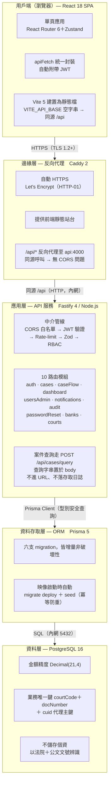
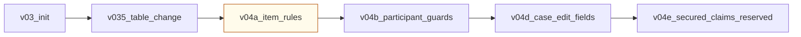
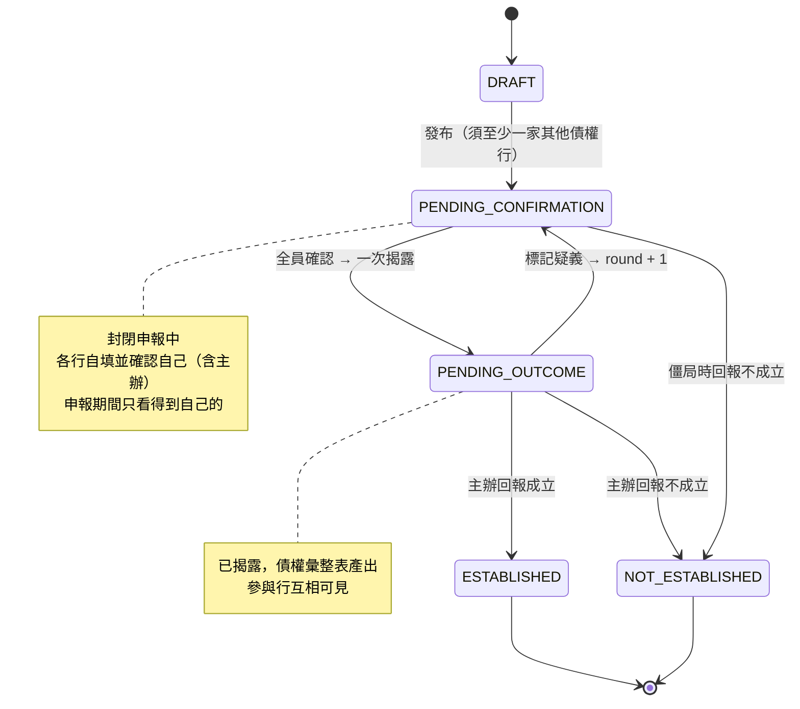
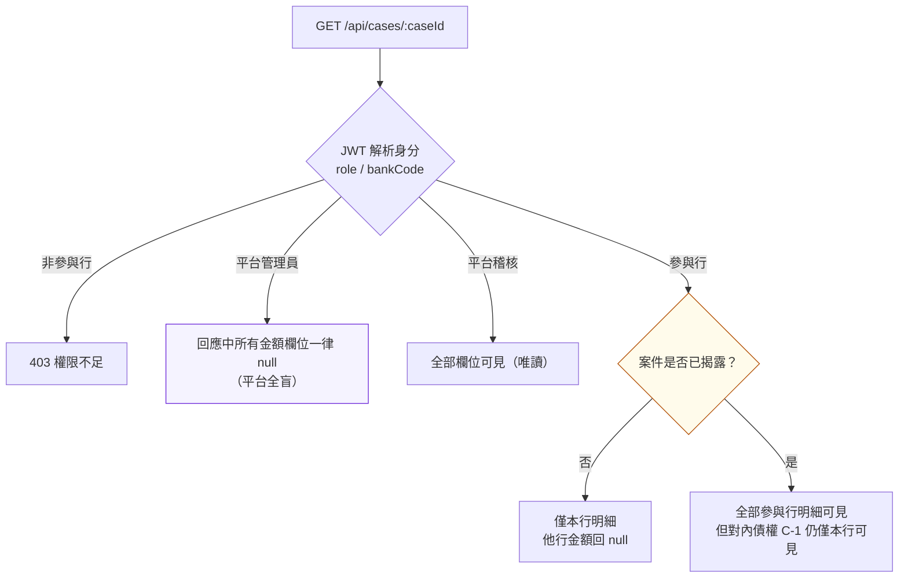
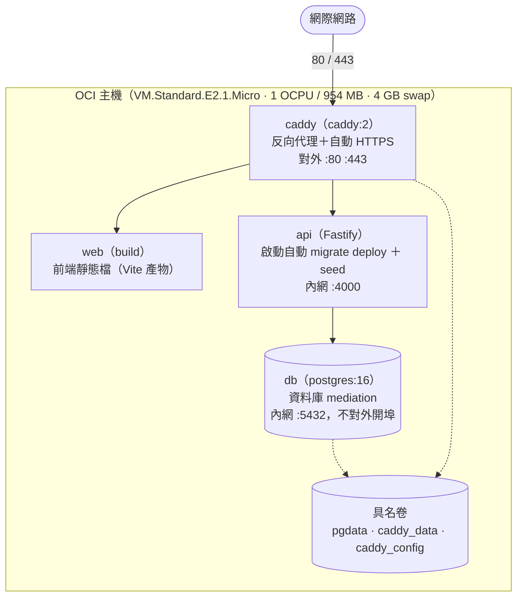

# 系統技術架構圖

> 前置調解債權交換平台　·　v0.5　·　概念驗證／聯合試辦（POC）
> 圖像版（資訊更密、可列印）：[`系統技術架構圖.html`](./系統技術架構圖.html)

技術堆疊：React 18 + TypeScript · Vite 5 · Tailwind 3 · React Router 6 · Zustand · Fastify 4 · Prisma 5 · Zod · PostgreSQL 16 · Caddy 2 · Docker Compose

---

## 一、分層架構

### 資料表（13 個）

`Case` · `CreditItem` · `SecuredCreditItem` · `CaseParticipantBank` · `DeclarationSnapshot` · `CaseDoubt` · `Notification` · `AuditLog` · `User` · `Bank` · `Court` · `PasswordResetRequest` · `AccessCode`

- `secured_credit_items`（有擔保債權）欄位**已建置但保留待啟用**，個資處理方式確認後再開放。
- 快照亦記錄該輪**被排除者**（移出／自行拒絕及其理由），使每一輪皆可完整還原。

### Migration 演進

> `v04a` 在建立「一債權種類一列」唯一索引**之前**，先合併既有重複列（防禦式遷移），確保既有申報資料不遺失。

---

## 二、案件狀態機

| 狀態 | 意義 |
|---|---|
| `DRAFT` | 主辦起案＋邀請，尚未發布 |
| `PENDING_CONFIRMATION` | 封閉申報中 |
| `PENDING_OUTCOME` | 全員確認、已揭露，待主辦回報 |
| `ESTABLISHED` / `NOT_ESTABLISHED` | 終態，**鎖死**、不得以同文號新建 |

**組成變更防護：** 主辦移出參與行或該行自行拒絕參與時，即使剩餘各行恰已全數確認，系統**刻意不自動揭露**；須由主辦另行執行 `POST /:caseId/disclose` 二次確認。已揭露後發生組成變更則**一律退回重新確認**。

---

## 三、資訊可視性閘門

**同一支 `GET /api/cases/:caseId`，五種身分五種回應。**

可視性**不是由前端隱藏**，而是後端在組裝回應時逐欄位決定：不可見的欄位回傳 `null`，他行的數字**從未離開伺服器**。整份案件只有一個閘門——**全員確認後的揭露**；在此之前與之後，是兩個不同的資訊世界。

| 觀看者 | 案件基本資料 | 本行自身明細 | 他行明細 **揭露前** | 他行明細 **揭露後** | 彙整總額 | 對內債權 C-1 （他行的） |
|---|:---:|:---:|:---:|:---:|:---:|:---:|
| **參與行本身** BANK_STAFF | 可見 | 可見 | `null` | 可見 | 可見 | **永不可見** |
| **平台稽核** PLATFORM_AUDITOR | 可見 | 可見 | 可見 | 可見 | 可見 | 可見 |
| **平台管理員** PLATFORM_ADMIN | 可見 | **永不可見** | **永不可見** | **永不可見** | **永不可見** | **永不可見** |
| 已被移出／自行退出之行 | 403 | — | — | — | — | — |
| 非本案之其他銀行 | 403 | — | — | — | — | — |

- **平台全盲**：平台管理員負責帳號、銀行與法院主檔的維運，**所有金額欄位一律回傳 `null`**——不是介面不顯示，而是資料不出庫。
- **稽核全見**：可讀取全部欄位以履行查核義務，**但為唯讀**：不得建案、填報、確認或回報結果。
- **對內債權（C-1）**：`internalPrincipal` / `internalInterest` 僅該行本身與稽核可見，**即使揭露後亦不對他行釋出**；不進入彙整表總額。

**寫入面的對稱限制：** 各行只能寫自己的明細——`PUT /:caseId/my-items` 的寫入對象由 JWT 內的 `bankCode` 反查取得，**不接受前端指定參與者**，因此「代他行填報」在結構上不可能發生。已確認者須先撤回確認才能修改；已揭露者須經疑義退回才能修改。

---

## 四、部署拓撲

Docker Compose（`docker-compose.fullstack.yml`，專案名 `-p dataexchange`）· 單一 OCI 主機 · 四容器

> ⛔ **不得在部署主機上 build** —— 主機僅 1 OCPU / 954 MB，容器內 `npm ci` + `vite build` 會把整台機器拖垮。
> 例行升版一律使用 [`deploy/build-and-ship.sh`](../../deploy/build-and-ship.sh)（本機建置 → 傳送映像 → `up -d --no-build`）。詳見 [`deploy/README.md`](../../deploy/README.md)。

---

## 五、橫切關注點

| | |
|---|---|
| **安全** | JWT（HS256）無狀態驗證、bcrypt 密碼雜湊、Rate-limit、CORS 白名單、憑證自動更新；可執行動作與可見範圍**一律由後端把關** |
| **可視性治理（RBAC）** | 平台全盲 · 稽核全見 · C-1 對內債權（見第三節） |
| **稽核軌跡** | 申報、確認、撤回、揭露、疑義、回報等關鍵事件皆同步寫入 `AuditLog`，與主流程在同一請求內完成 |
| **終態鎖死** | 結案後不可更正、不得以同文號新建；回報採兩段式確認防呆 |
