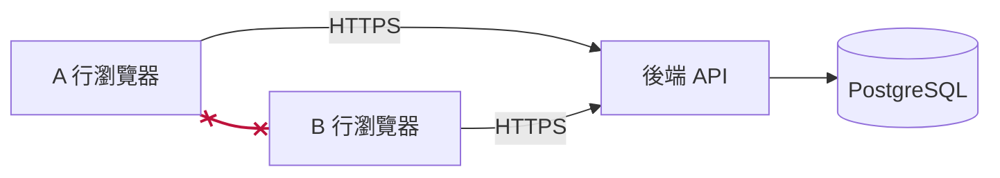
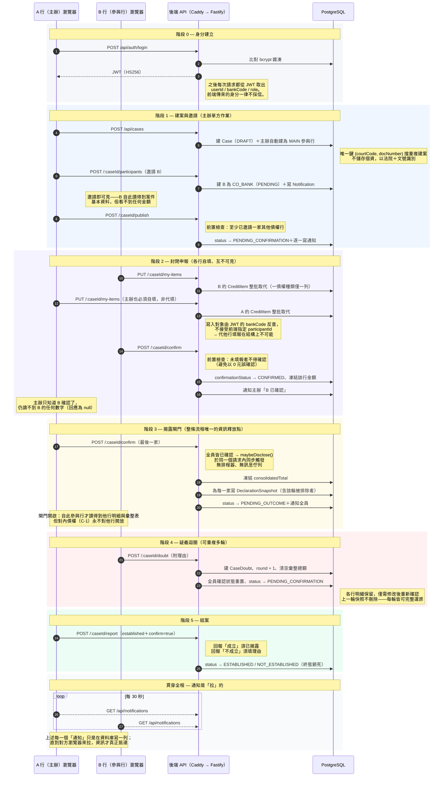
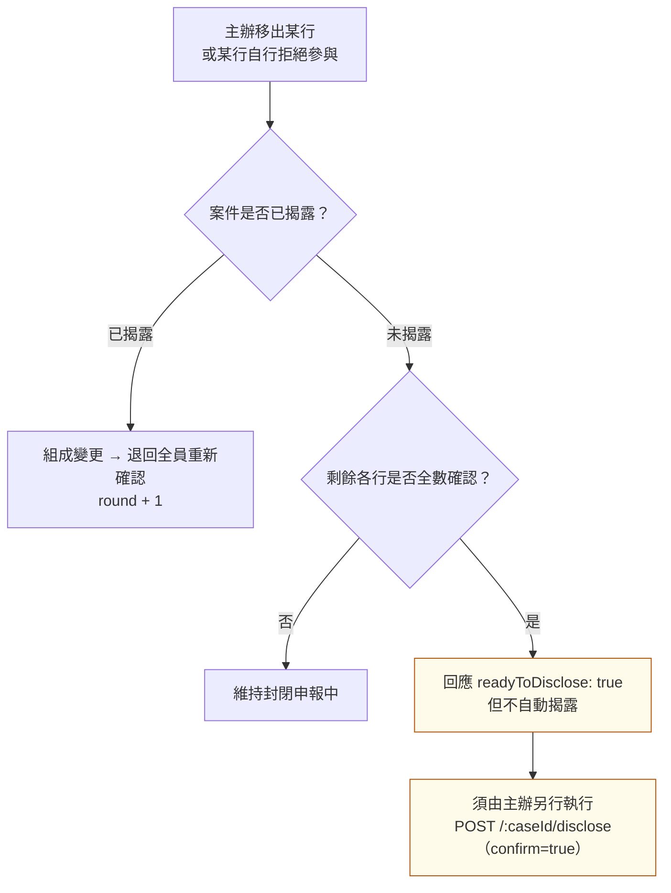

# 資訊流架構圖 — 案件生命週期

> 前置調解債權交換平台　·　v0.5
> 一件案子從建立到結案，資訊如何在前後端之間流動。
> 圖像版（資訊更密、可列印）：[`資訊流架構圖_案件生命週期.html`](./資訊流架構圖_案件生命週期.html)

---

## 最本質的一句話

**銀行與銀行之間沒有任何直接連線。** 所謂「案件在系統間傳遞」，實際上是各行前端各自呼叫**同一個後端 API**、讀寫**同一個資料庫**。

| | |
|---|---|
| **PULL，不是 PUSH** | 平台不對銀行端送件，沒有 webhook、不需要銀行端開放任何 inbound。所有「通知」只是資料庫寫一列，對方前端每 30 秒輪詢才拉到。 |
| **過濾在後端發生** | 他行的數字從未離開伺服器。同一支 `GET /api/cases/:caseId`，五種身分拿到五種內容——不是前端隱藏。 |

> 兩行之間那條打叉的紅線代表**不存在的連線**：無檔案交換、無點對點通道。

---

## 案件生命週期時序

---

## 例外：組成變更後不自動揭露

若主辦以 `POST /:caseId/participants/:bankCode/remove` **移出**某行、或某行**自行拒絕參與**，而使剩餘各行恰好全數確認，系統**刻意不自動揭露**。

**目的：** 讓「排除某一行」與「定案」成為兩個分開、各自留痕的決定。否則主辦可藉移出未確認的參與行「湊成」全員確認而強制定案。

---

## 三個由這張圖直接得出的結論

**1. 銀行端不需開放任何 inbound**
平台從不主動連線至銀行。所有互動都由銀行端**發起 outbound HTTPS**，經 Caddy（TLS 1.2+）進入 API。因此不需要在銀行防火牆開孔、不需要固定 IP 白名單接收端，也沒有 webhook 重送與簽章驗證的問題。

**2. 沒有非同步元件，狀態機就是全部的協調機制**
無訊息佇列、無排程器、無背景工作。**每一次狀態轉換都由某一次 API 呼叫同步完成**，成功即已落庫。代價是沒有重試機制；好處是**不存在「訊息卡在佇列」的中間態**——任一時刻資料庫的狀態就是事實。

**3. 每一個寫入都同步留痕**
圖中每一個箭頭在成功後都會同步寫入 `AuditLog`（動作、執行人、所屬行、目標案件、時間、來源 IP）。稽核軌與主流程在**同一個請求內**完成，不是事後補寫，因此不會出現「有動作但沒紀錄」。
