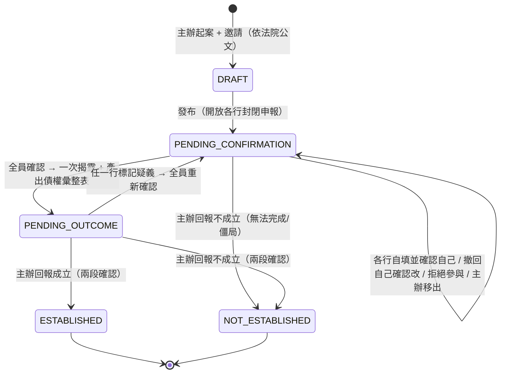
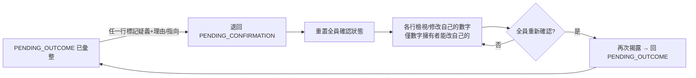

# 案件流程設計：債權申報與彙整（定案・待實作）

> 建立：**2026-07-28**　分支：`main`　狀態：**設計定案，尚未實作**
> 對象：**現行 v0.2 系統**（React + Fastify + Postgres）之流程改版。與 Fabric 版設計（`feat/fabric-poc`）**無關**、各自獨立。
> 現行實作現況見 [`系統現況與執行說明.md`](./系統現況與執行說明.md)。本文件為改版後的目標設計。

---

## 1. 定位與範圍

**本系統只解決「跨行債權資訊傳遞與彙整」**：

> 主辦起案（依法院公文）→ 各債權行**各自封閉申報並確認**自己的債權 → 全員確認後**一次揭露、產出債權彙整表** → 主辦**線下與債務人確認後回報案件「成立／不成立」** → 結束。

**明確不做**：
- 還款計劃、逐月還款、結清/毀諾等**還款管理**。
- **法定期限／時效控管**（本系統非處理時限之工具）。
- 債務人、法院之系統內互動（**均在線下**）。

---

## 2. 設計原則（定案）

- **各行自填自己的**債權明細（**非主辦代填**）；主辦亦自填自己的、可自我確認與修改。
- **封閉式申報**：申報期間各行**只看得到自己的**；**全員填完並確認後才一次揭露**（防止參考他行數字而錨定）。
- **揭露後**：產出**債權彙整表**，**參與行互相可見**；**非參與行永遠看不到**。
- **數字不需多方同意**：各行只為自己的數字負責，不替他行修改、不互相審批。
- **可回溯**：揭露後有疑義 → 任一參與行標記 → **全員重新確認**。
- **結果由主辦回報**：主辦線下與債務人確認後回報**成立／不成立**（系統只存證，**非系統裁定**）。

---

## 3. 角色與可視性

| 角色 | 申報期（PENDING_CONFIRMATION） | 揭露後（PENDING_OUTCOME 起） |
|---|---|---|
| 參與行（含主辦） | 只見**自己的**數字＋**確認進度**＋**參與行名單**（不含他行數字） | **債權彙整表全可見**（各行數字互見） |
| 非參與行 | 看不到此案 | 看不到此案 |
| 平台管理員（開發商） | 只見**案件狀態／進度**，**不見任何數字** | 同左（**不見數字**） |
| 平台稽核 | **可見全部**（含各行明細） | 可見全部 |

> 封閉期的「封閉」只對**銀行之間**；**稽核可見全部**（監督）、**平台管理員只見狀態不見數字**。

---

## 4. 流程與狀態機

**① DRAFT — 起案與邀請**：主辦依**法院公文**建案（法院＋公文文號）、輸入參與行名單（名單來源＝法院公文，系統不驗證完整性）、可自由增刪；發布 → `PENDING_CONFIRMATION`。

**② PENDING_CONFIRMATION — 各行封閉申報並確認**
- 每一參與行（含主辦）填入**自己的**債權明細並確認。
- **確認後、揭露前仍可撤回自己的確認再改**（撤回使該案回到未達全員確認）。
- 此期間各行只見自己的數字，可見確認進度與參與行名單。
- 全員皆確認 → **一次揭露、產出債權彙整表** → `PENDING_OUTCOME`。
- 若無法完成（僵局、關鍵行不配合），主辦可逕行回報**不成立** → `NOT_ESTABLISHED`。

**③ PENDING_OUTCOME — 已彙整、待主辦回報**
- 產出**債權彙整表**（§7），參與行互相可見。
- 有疑義 → 任一行標記 → 退回 `PENDING_CONFIRMATION` 全員重新確認（§6）。
- 主辦線下與債務人確認後，經**兩段式確認**回報成立／不成立 → 終態。

**④ ESTABLISHED（成立）／ NOT_ESTABLISHED（不成立）**：**終態、完全鎖死、無更正通道**。成立→彙整表鎖定為正式紀錄；不成立→附理由封存。

---

## 5. 參與清單管理

- **主辦移出參與行**：主辦可將某行移出（誤加、非債權人）。
- **參與行拒絕參與**：某行回覆「我不是此案債權人」→ **自行生效即移出**（附理由、留稽核、通知主辦；主辦可重新邀請以防誤拒）。
- **組成變動影響**：
  - `PENDING_CONFIRMATION` 期間增刪 → 「全員確認」門檻依新清單重算。
  - `PENDING_OUTCOME`（已揭露）後增刪 → 視為組成變更，比照疑義**退回全員重新確認**。

---

## 6. 揭露後疑義 → 全員重新確認（迴圈）

- **誰能標記**：任一參與行（含主辦）；**理由必填**、可指向某行/某筆；**不限次數**、每次留稽核。
- **標記後**：退回 `PENDING_CONFIRMATION`，**全員確認狀態全部重置**（每行都要重新確認）。
- **誰能改數字**：僅**數字擁有者**能改自己的（標記者不能替他行改）。
- **重新確認輪**因已揭露，維持**互相可見**（與第一輪封閉不同）。
- 若始終無法收斂，主辦可逕行回報**不成立**作為出口。
- 主辦要退回一律走此疑義機制（不另設專屬退回）。

---

## 7. 債權彙整表（核心產出）

全員確認揭露後產生：

| 參與行 | 本金 | 利息 | 違約金 | 其他費用 | 該行債權總額 |
|---|---|---|---|---|---|
| 台北富邦 012 | … | … | … | … | … |
| 玉山 808 | … | … | … | … | … |
| …（各參與行） | | | | | |
| **總計** | | | | | **全案債權總額** |

- 參與行互相可見；平台管理員不可見數字；稽核可見。
- 成立時彙整表**鎖定為正式紀錄**；不成立則附理由封存。
- （已移除舊「內部帳列 internalTotal」欄位。）

---

## 8. 資料主鍵、版本化與終態

- **案件主鍵**：`(courtCode, docNumber)` **唯一**。
- **終態不可回頭**：結案（成立/不成立）後，**不得以同一文號新建案件**，亦**無任何重開/更正通道**。
- **誤按防呆**：回報成立/不成立採**兩段式確認**，**第二段明確重述結果（成立/不成立）＋警告終態不可回復**——擋手滑，並讓「選錯選項」在關案前被看見。
- **版本化**：各行的申報/確認記錄**保存每一輪歷史**（誰申報什麼、誰重開、何時），非僅存最新值，供稽核。

---

## 9. 影響範圍（相對現行 v0.2，高層）

- **狀態機**：`DRAFT → PENDING_CONFIRMATION → PENDING_OUTCOME → ESTABLISHED/NOT_ESTABLISHED`；**移除** `IN_REPAYMENT/SETTLED/TERMINATED/PENDING_PLAN` 與所有還款狀態。
- **資料模型**：
  - 明細改由**各行自填自己的 `CreditItem`**（移除主辦代填他行）。
  - `confirmationStatus` **納入主辦**；新增「揭露」表達、「疑義標記」（誰標、時間、理由、指向）、「回報結果」（成立/不成立＋不成立理由）。
  - **移除**：`internalTotal`、所有計劃/還款欄位（`monthlyInstallment`/`planInstallments`/`planStartDate`/`planRatio`、`RepaymentPeriod`/`RepaymentAllocation`）。
  - 申報/確認記錄**版本化**。
- **可視性（後端 RBAC）**：申報期各行只見自己＋進度＋名單；平台管理員只見狀態不見數字；稽核可見全部；揭露後參與行互見彙整表。
- **API（增/改/移除）**：
  - 改：發布不再要求計劃。
  - 增：各行填/改**自己**明細、各行（含主辦）**確認自己／撤回自己確認**、**拒絕參與**、主辦**移出參與行**、**標記疑義**、主辦**回報成立/不成立（兩段確認）**。
  - 移除：主辦代填他行、對主辦的 dispute、所有還款/結清/終止 API。
- **前端**：案件詳情呈現「申報期（只見自己）／已彙整（債權彙整表）」；操作含確認/撤回、拒絕參與、移出、標記疑義、兩段式回報成立/不成立。
- **稽核事件**：新增 `DISCLOSED`、`REOPENED_FOR_DOUBT`、`PARTICIPATION_REJECTED`、`PARTICIPANT_REMOVED`、`CASE_ESTABLISHED`、`CASE_NOT_ESTABLISHED`；移除還款相關事件。

---

## 10. 定案決策彙整

| 項目 | 定案 |
|---|---|
| 系統範圍 | 只做債權申報與彙整；**無還款、無時限** |
| 申報方式 | **各行自填自己的**（非主辦代填）；主辦自我確認＋可改 |
| 保密 | 封閉申報 → 全員確認**一次揭露**；參與行互見、非參與行不可見；平台**只見狀態不見數字**、稽核可見全部 |
| 名單來源 | 主辦依**法院公文**線下取得後輸入（系統不驗證完整性） |
| 參與管理 | 主辦可移出；參與行可**自行拒絕即生效**＋主辦可重邀 |
| 疑義 | 理由必填、不限次數、留稽核；**全員重新確認**；無法收斂→主辦回報不成立 |
| 揭露前修改 | 允許**撤回自己的確認再改** |
| 結果 | 主辦**線下與債務人確認後回報**成立/不成立（系統存證、非裁定） |
| 誤按防呆 | **兩段式確認＋第二段重述結果** |
| 終態 | **完全鎖死、無更正**；`(courtCode,docNumber)` 唯一、不得同文號新建 |
| 版本化 | 申報/確認記錄保存每輪歷史 |
| 債務人/法院 | **全程線下**、無系統互動 |
