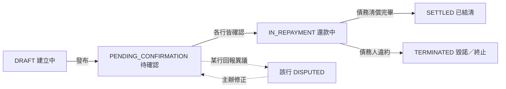
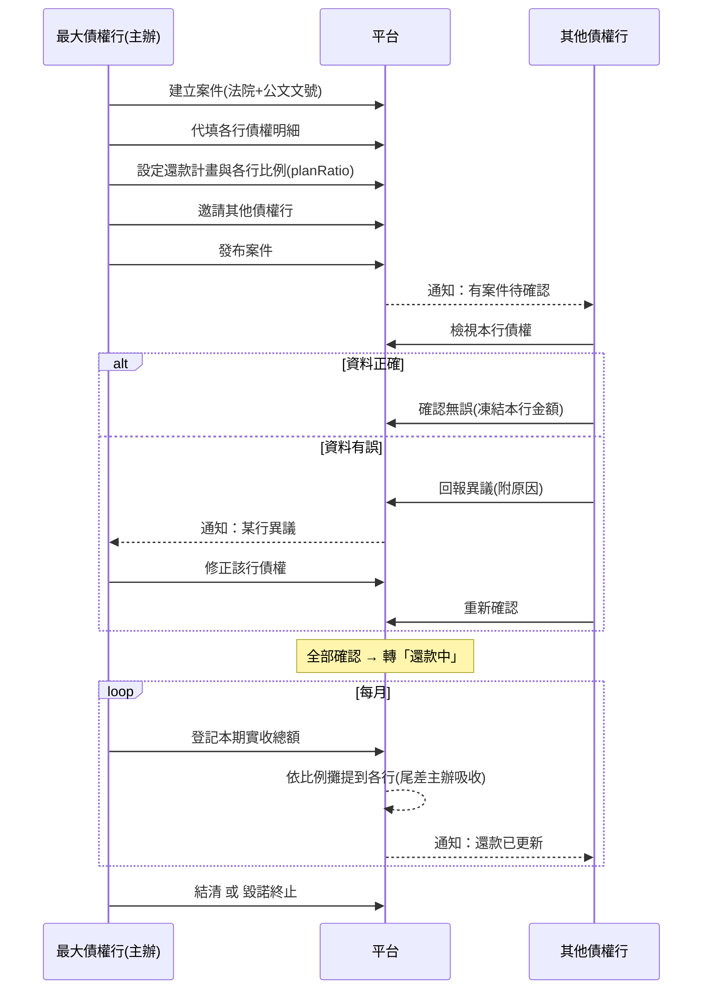
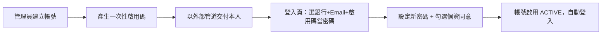

# 操作與測試手冊（manual）

> 適用版本：v0.2（v2 資料模型）。本手冊說明**各角色如何操作**與**如何測試**，並附流程圖。
> 平台網址：本機 demo 為 `http://localhost:5173`；OCI 部署為 `http://<公網IP>`。
> 技術現況與部署見 [`docs/系統現況與執行說明.md`](docs/系統現況與執行說明.md)。

---

## 一、系統簡介與角色

跨銀行「前置調解債權申報與還款管理」平台。一件案件＝一位債務人的一次調解，以**法院公文文號**辨識（不儲存債務人個資）。

| 角色 | 說明 | 主要能做的事 |
|---|---|---|
| **平台管理員（ADMIN）** | 平台管理單位 | 建立帳號並核發啟用碼、機構（銀行/法院）啟用管理、核發密碼重置碼、檢視稽核 |
| **最大債權行（主辦）** | 建立案件的銀行（BANK_STAFF） | 建案、代填各行債權、設定還款計畫與比例、邀請其他債權行、發布、逐月登記還款、結清/終止 |
| **其他債權行** | 受邀的銀行（BANK_STAFF） | 檢視本行債權、確認無誤或回報異議、檢視還款對照 |
| **平台稽核（PLATFORM_AUDITOR）** | 平台管理單位 | 全案唯讀、可見各行內部金額（internalTotal）、檢視稽核 |

> 「最大債權行／其他債權行」是**因案動態認定**：同一個銀行帳號，在自己建立的案件是主辦，在別人邀請的案件就是其他債權行。

---

## 二、流程總覽圖

### 2-1 案件生命週期

### 2-2 角色互動（時序）

### 2-3 正式區帳號啟用

---

## 三、共通操作

### 3-1 登入
1. 開啟平台網址 → 登入頁。
2. **銀行／機構下拉**選擇你所屬的機構（務必選對，選錯會顯示通用錯誤）。
3. 輸入 **Email** 與 **密碼** → 按「登入」。

### 3-2 帳號啟用（正式區新帳號首次登入）
1. 向管理員取得**啟用碼**（經你們內部管道交付）。
2. 登入頁：選銀行、輸入 Email、**把啟用碼填在「密碼／啟用碼」欄** → 按登入。
3. 系統跳出「啟用帳號」畫面：輸入**新密碼**（至少 8 碼）、再次確認、**勾選個資蒐集/利用同意**（必勾）→ 按「完成啟用並登入」。
4. 之後改用你設定的新密碼登入。
> demo 區的示範帳號已預先啟用，可直接用密碼 `Demo@1234` 登入，無需啟用。

### 3-3 忘記密碼
1. 登入頁 →「忘記密碼」。
2. 分頁「**申請重置**」：選銀行＋Email → 送出（管理員會收到申請）。
3. 向管理員取得**重置碼**後，回本頁分頁「**我已有重置碼**」：填銀行＋Email＋重置碼＋新密碼 → 送出。

---

## 四、各角色操作手冊

### 4-1 平台管理員（ADMIN）
左側選單：使用者與權限管理、機構啟用管理、操作紀錄。

**建立帳號並發啟用碼**
1. 「使用者與權限管理」→ 右上「＋ 建立帳號」。
2. 填 Email、姓名、選所屬機構（僅列已啟用機構）、選角色（銀行人員／平台稽核／平台管理員），部門職稱選填 → 「建立並產生啟用碼」。
3. 畫面顯示**一次性啟用碼**（僅此一次）→ 複製，經內部管道交付本人。
4. 需要時可對待啟用帳號按「**重發啟用碼**」。

**密碼重置**
- 使用者送出申請後，頁面上方出現「密碼重置申請」→ 按「**核發重置碼**」取得重置碼交付本人。
- 也可直接對已啟用帳號按「**發重置碼**」。

**帳號管理**：對帳號可「停用 / 復用 / 解鎖（解除登入鎖定）」。

**機構啟用管理**
1. 「機構啟用管理」→ 切換「金融機構 / 法院」分頁。
2. 對機構按「啟用 / 停用」。**只有啟用的機構**才會出現在登入下拉與建案選單。

**稽核**：「操作紀錄」可依事件類型篩選、檢視所有關鍵操作。

---

### 4-2 最大債權行（主辦）
左側選單：新增案件、案件列表。

**建立案件**
1. 「新增案件」→ 選**法院**（僅列啟用法院）、填**公文文號**、收文日、確認期限、備註 → 「建立案件」。
2. 建立後進入案件詳情頁，你的銀行即該案「最大債權行」。

**代填債權**
- 詳情頁「各行債權」區，對每一家（含自己）按「**代填 / 修正債權**」→ 逐列輸入債權種類、本金、利息、違約金、其他費用、內部帳列（僅稽核可見）→ 儲存。

**設定還款計畫與比例**
- 詳情頁「參與銀行與確認進度」區 →「**設定還款計畫／比例**」→ 填每月應還總額、期數、起始月，並設定**各行還款計畫比例**（加總須為 1，與債權占比無關）→ 儲存。

**邀請其他債權行**
- 同區塊下方「邀請其他債權行」下拉選銀行 → 「邀請」。

**發布**
- 備妥計畫與至少一家其他債權行後 → 下方「**發布案件**」。發布後通知各行確認，且計畫比例鎖定（僅管理員可再改）。

**逐月登記還款**（案件為「還款中」）
1. 「還款對照表」→「**登記本期還款**」。
2. 填期別（YYYY-MM）與**本期實際收到總額**（單一數字）→ 儲存。
3. 系統依各行比例**自動攤提**，尾差由主辦吸收（有尾差會顯示提醒）。

**結清 / 終止**：還款中案件可「**結清案件**」或「**毀諾／終止**」（需填原因）。

---

### 4-3 其他債權行（受邀）
1. 收到通知後，「案件列表」開啟該案。
2. 於「各行債權」檢視**本行**債權明細（他行明細不開放）。
3. 上方橫幅：
   - 資料正確 → 「**確認無誤**」（確認當下凍結本行金額）。
   - 資料有誤 → 「**回報異議**」填原因；待主辦修正後，再重新確認。
4. 案件進入還款中後，於「還款對照表」檢視本行的原定應還／實際攤得／剩餘債務／完成率。
- 案件列表對「待你確認」的案件可勾選後**批次確認**。

---

### 4-4 平台稽核（PLATFORM_AUDITOR）
- 全部案件唯讀檢視；債權明細可見**內部帳列金額（internalTotal）**（其他角色不可見）。
- 可檢視「操作紀錄」。

---

## 五、各階段「誰能做什麼」

| 案件狀態 | 主辦可做 | 其他債權行可做 |
|---|---|---|
| **DRAFT 建立中** | 代填債權、設計畫/比例、邀請、發布 | —（尚未看到） |
| **PENDING_CONFIRMATION 待確認** | 修正被異議的資料 | 確認無誤 / 回報異議 |
| **IN_REPAYMENT 還款中** | 登記本期還款、結清、毀諾終止 | 檢視還款對照 |
| **SETTLED / TERMINATED** | 唯讀 | 唯讀 |

---

## 六、測試腳本（使用目前 demo 假資料）

> 以下帳號、案號、金額**均為目前 demo 的假資料**，僅供驗證流程。所有密碼皆 `Demo@1234`（登入請選對銀行）。

### 6-0 Demo 帳號
| 角色 | 銀行 | Email |
|---|---|---|
| 平台管理員 | 平台管理單位（PLATFORM） | `admin@platform-demo.local` |
| 平台稽核 | 平台管理單位（PLATFORM） | `auditor@platform-demo.local` |
| 銀行人員（富邦） | 台北富邦（012） | `fubon.main@bank.local` |
| 銀行人員（玉山） | 玉山（808） | `esun.co@bank.local` |
| 銀行人員（台新） | 台新（812） | `taishin.co@bank.local` |
| 待啟用帳號 | 玉山（808） | `pending.co@bank.local`（啟用碼 `ACT-DEMO-808`） |

### 6-1 Demo 案件（已預先建立，涵蓋各階段）
| 公文文號 | 法院 | 狀態 | 主辦 | 備註 |
|---|---|---|---|---|
| 北院民聲字第1130000101號 | 臺北 | DRAFT | 富邦 012 | 草稿、可代填/發布 |
| 北院民聲字第1130000102號 | 臺北 | 待確認 | 富邦 012 | 玉山已確認、台新待確認 |
| 士院民聲字第1130000103號 | 士林 | 待確認 | 富邦 012 | 台新**已回報異議** |
| 北院民聲字第1130000104號 | 臺北 | 還款中 | **玉山 808** | 已 2 期還款 |
| 士院民聲字第1130000105號 | 士林 | 已結清 | 富邦 012 | — |
| 北院民聲字第1130000106號 | 臺北 | 毀諾終止 | 富邦 012 | — |

### 6-2 測試案例

**T1 一般登入**
- 玉山（808）+ `esun.co@bank.local` + `Demo@1234` → 進入 Dashboard。
- ✅ 預期：右上顯示所屬機構「玉山銀行（808）」。

**T2 帳號啟用（重點新功能）**
1. 選 玉山（808）+ `pending.co@bank.local` + 密碼欄輸入 `ACT-DEMO-808` → 登入。
2. ✅ 預期：跳出「啟用帳號」畫面。
3. 設新密碼（≥8碼）+ 勾同意 → 完成。
4. ✅ 預期：自動登入；之後可用新密碼登入。

**T3 建立案件 → 發布（主辦：富邦）**
1. 富邦登入 →「新增案件」→ 選臺北地院、文號自訂（如 `北院測試字第001號`）→ 建立。
2. 「代填/修正債權」填自己與受邀行的明細。
3. 「設定還款計畫／比例」：每月 30000、12 期、起始月；比例例如富邦 0.5／玉山 0.3／台新 0.2（加總=1）。
4. 「邀請其他債權行」邀玉山、台新。
5. 「發布案件」。
- ✅ 預期：狀態變「待確認」，玉山/台新收到通知。

**T4 確認 / 異議（其他債權行：台新）**
1. 台新登入 → 開 `北院民聲字第1130000102號` → 檢視本行債權。
2. 按「確認無誤」。
- ✅ 預期：該案兩家皆確認 → 狀態轉「還款中」、凍結各行金額。
3. 另開 `士院民聲字第1130000103號`（台新為異議中）→ 主辦（富邦）「代填/修正債權」後，台新重新「確認無誤」。

**T5 登記還款與對照表（主辦：玉山）**
1. 玉山登入 → 開 `北院民聲字第1130000104號`（還款中）。
2. 「登記本期還款」：期別 `2026-07`、實收總額 `25000` → 儲存。
3. ✅ 預期：對照表出現各行「原定應還 / 實際攤得 / 剩餘債務 / 計畫完成率 / 債權回收率」；若有尾差，該期顯示「尾差由主辦吸收」提醒。

**T6 結清 / 終止（主辦）**
- 於還款中案件按「結清案件」或「毀諾／終止」（填原因）→ ✅ 狀態改變、各行收到通知。

**T7 後台（管理員）**
1. admin 登入 →「使用者與權限管理」→「＋建立帳號」建一個測試帳號 → ✅ 取得啟用碼。
2. 「機構啟用管理」→ 啟用一家目前停用的銀行（如第一銀行 007）→ ✅ 該行之後出現在登入下拉/建案選單。
3. 「操作紀錄」→ ✅ 看到上述操作的稽核事件。

**T8 稽核唯讀 + 內部金額（稽核）**
- auditor 登入 → 開任一案件 → ✅ 可見各行明細的「內部帳列」欄（其他角色看不到）；無任何編輯按鈕。

**T9 忘記密碼**
1. 登入頁「忘記密碼」→「申請重置」：玉山（808）+ `esun.co@bank.local` → 送出。
2. admin →「核發重置碼」→ 取得重置碼。
3. 回「忘記密碼／我已有重置碼」填碼與新密碼 → ✅ 以新密碼登入。

---

## 七、常見問題／排錯

| 問題 | 原因與處理 |
|---|---|
| 登入顯示「銀行／帳號／密碼不正確」 | 多半是**銀行下拉選錯**（要選帳號所屬機構）；或密碼錯。玉山請選 **808**。 |
| 啟用碼／重置碼無效 | 碼為**一次性、有效期 3 天**；過期或已使用請請管理員重發。 |
| 連續登入失敗被鎖 | 連續 5 次密碼錯鎖 15 分鐘；請管理員「解鎖」或等候。 |
| 下拉找不到某銀行／法院 | 該機構**未啟用**；請管理員於「機構啟用管理」開啟。 |
| 發布案件失敗 | 需先「設定還款計畫／比例（加總=1）」且**至少邀請一家**其他債權行。 |
| 還款攤提出現小數尾差 | 正常；系統讓**主辦吸收尾差**確保各行加總＝實收總額，並顯示提醒。 |
| 看不到別家銀行的明細 | 刻意設計：其他債權行僅能看**本行**明細；全明細僅主辦／管理員／稽核可見。 |

---

> 本手冊隨系統調整更新；如流程或畫面有異動，請以實際系統與 `docs/系統現況與執行說明.md` 為準。
